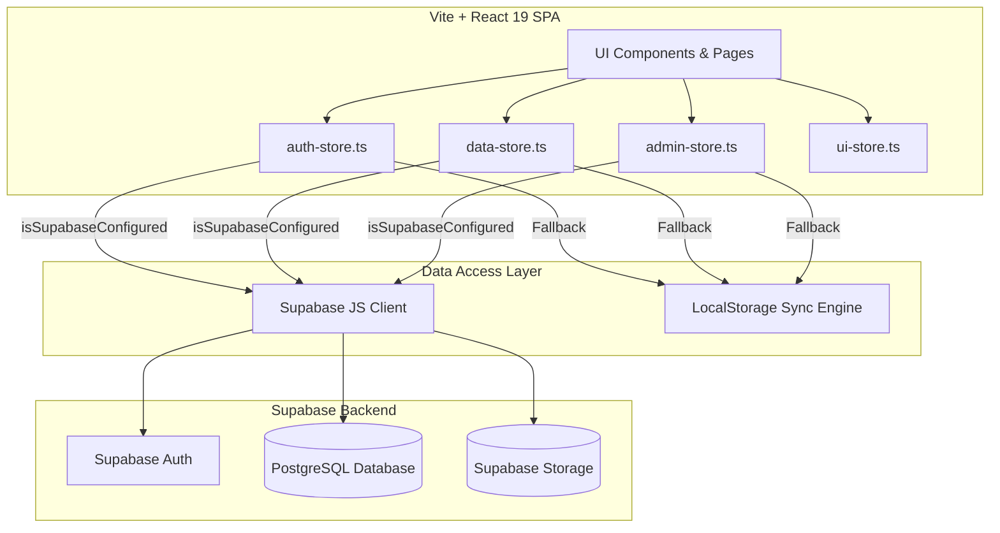
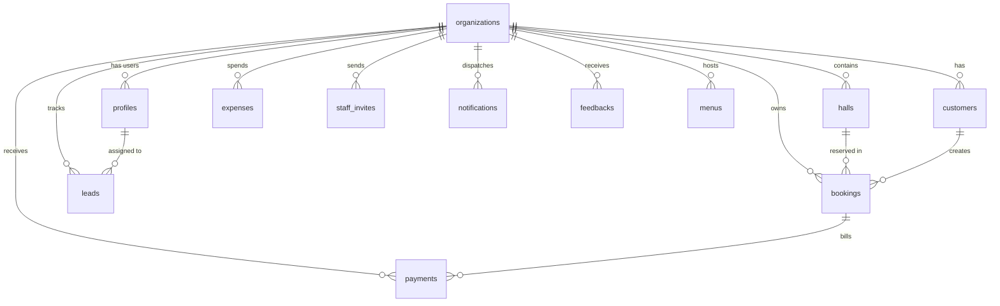
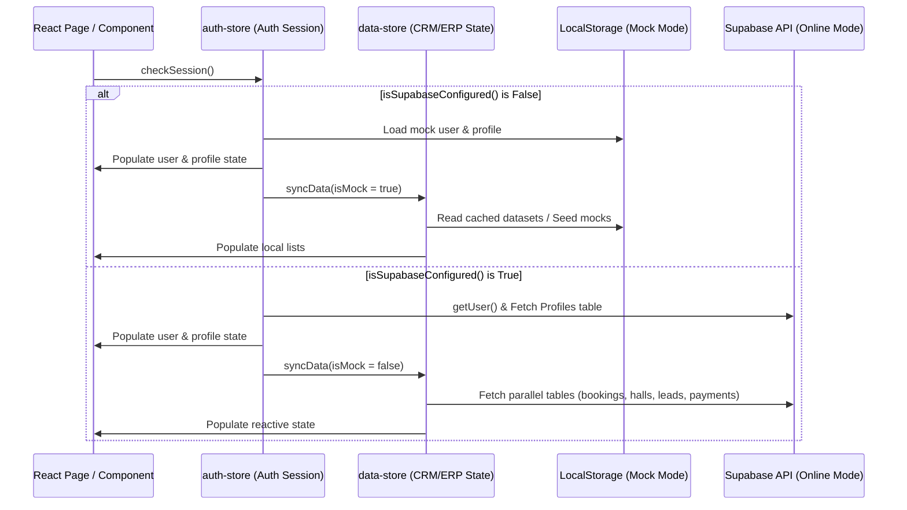

# VenuePro V2 — AI & Developer Knowledge Base (CONTEXT.md)

Welcome to the definitive architectural context and system specification file for **VenuePro V2**. This document is maintained as a high-fidelity guide for human engineers and AI models to understand the application’s design patterns, database structures, state management, security boundaries, and feature workflows.

---

## 1. System Overview & Objectives
VenuePro V2 is a premium **B2B SaaS Venue and Catering Management System** designed for banquet halls, hotels, convention centers, and multi-venue organizations. It bridges CRM (Leads, Customers) and ERP (Halls, Booking Calender, Payments, Invoices, Expenses, Catering Menus) into a single, cohesive dashboard.

### Core Objectives:
*   **Dual Mode Capability (Local Mock Mode / Supabase Mode)**: The application detects the presence of Supabase keys via `isSupabaseConfigured()`. If keys are absent or invalid, it gracefully falls back to **Local Mock Mode**, reading/writing from `localStorage` and seeding data from `src/lib/mock-data.ts`.
*   **Tenant Separation**: All user accounts are tied to an `organization_id` (`org_id`). Database Row-Level Security (RLS) ensures that tenants can never access or modify each other's data.
*   **Concurrency & Atomic Bookings**: Prevents double-booking halls on overlapping times via database-level locking and collision functions.
*   **Billing & Coupon Lifecycle**: Controls access to features dynamically through trial expirations, grace periods, and promotional coupon codes.

---

## 2. System Architecture



---

## 3. Tech Stack & Core Libraries

*   **UI Framework**: [React 19](https://react.dev) (Single Page Application).
*   **Build Tool**: [Vite 5](https://vitejs.dev) & TypeScript.
*   **Styling**: [Tailwind CSS 3](https://tailwindcss.com) with custom themes (animations, HSL harmonious colors, premium card designs).
*   **Routing**: [React Router DOM v7](https://reactrouter.com) (handles private layout, onboarding steps, and guards).
*   **State Management**: [Zustand v5](https://github.com/pmndrs/zustand) (stores auth sessions, tenant data, UI modals, and super-admin settings).
*   **Server State / Cache**: [TanStack React Query v5](https://tanstack.com/query) (for query management).
*   **Animation**: [Framer Motion v12](https://www.framer.com/motion) (supplies micro-animations, slide-ins, and card list transitions).
*   **Feedback & Alerts**: [Sonner](https://subner.github.io/sonner) for toasts, and Canvas Confetti.
*   **E2E Testing**: [Playwright](https://playwright.dev).

---

## 4. Directory Structure

```
VenueProV2/
├── supabase/
│   └── migrations/               # PostgreSQL schema migrations (idempotent)
├── src/
│   ├── assets/                   # Static logos, default avatars, empty states
│   ├── components/
│   │   ├── booking/              # Calendars, Booking Drawer, Booking conflict indicators
│   │   ├── customers/            # Customer tables, edit/add drawers
│   │   ├── layout/               # Header, Sidebar, AppLayout, Navigation
│   │   ├── leads/                # Lead pipelines, follow-up notifications
│   │   ├── payments/             # Payments drawers, receipt PDF generation
│   │   ├── settings/             # Org address settings, Hall creation, pricing controls
│   │   ├── shared/               # StatCards, Badges, ConfirmDialogs, ErrorBoundary
│   │   └── venues/               # Venue configurations, Catering menu packages
│   ├── lib/
│   │   ├── gst.ts                # Indian tax arithmetic (CGST, SGST, IGST)
│   │   ├── image.ts              # WebP conversion and client-side resizing
│   │   ├── mock-data.ts          # Complete seed data for Local Mock Mode
│   │   ├── permissions.ts        # Frontend RBAC rules check engine
│   │   ├── supabase.ts           # Supabase client wrapper & configuration guard
│   │   └── utils.ts              # Currency, date-fns, text styling utilities
│   ├── pages/
│   │   ├── Dashboard.tsx         # Analytical KPI dashboard and schedule calendar
│   │   ├── Bookings.tsx          # Manage venue reservations and billing
│   │   ├── Venues.tsx            # Manage Halls, Pricing, Rules, and Catering Menu Packages
│   │   ├── SuperAdmin.tsx        # System-wide promo codes, metrics, & logs panel
│   │   └── ...                   # Landing, Onboarding, Leads, Expenses, Settings
│   ├── stores/
│   │   ├── auth-store.ts         # Session handling, triggers sync on checkSession
│   │   ├── data-store.ts         # Workspace entities CRM/ERP core logics
│   │   ├── admin-store.ts        # Platform management store
│   │   └── ui-store.ts           # Global modal toggles and loaders
│   └── types/                    # TypeScript domain interfaces
```

---

## 5. Database Schema & Relationships

### Entity Relationship Diagram (ERD)



### Table Definitions & Specifications

#### 1. `public.organizations`
Stores tenant organizations and their billing configurations.
*   `id` (uuid, Primary Key): Unique tenant identifier.
*   `name` (text, Not Null): Trade/Company name.
*   `slug` (text, Unique): URL segment prefix.
*   `gstin` (text, Nullable): Indian GST Number.
*   `address`, `city`, `state`, `phone`, `email` (text): Contact information.
*   `settings` (jsonb): Defaults to currency `INR`, timezone `Asia/Kolkata`, `gst_enabled` = true.
*   `plan` (text): Default `'pro'` (enables pro features during trial). Choices: `'free'`, `'starter'`, `'pro'`, `'enterprise'`.
*   `trial_ends_at` (timestamptz): Calculated expiration date (typically `created_at + 14 days`).
*   `subscription_status` (text): Trial/Billing status. Choices: `'trial'`, `'active'`, `'past_due'`, `'canceled'`, `'expired'`.
*   `promo_codes_applied` (text[]): List of coupon codes that extended the trial.

#### 2. `public.profiles`
Stores user profile information, linked to Supabase's `auth.users`.
*   `id` (uuid, Primary Key): References `auth.users(id)`.
*   `org_id` (uuid): References `organizations(id)`.
*   `email` (text, Not Null).
*   `full_name` (text, Not Null).
*   `role` (text): RBAC role constraint. Choices: `'owner'`, `'manager'`, `'staff'`, `'finance'`, `'super_admin'`.
*   `is_active` (boolean): Flag for active/inactive staff.

#### 3. `public.halls`
Configures spaces inside a venue.
*   `id` (uuid, Primary Key).
*   `org_id` (uuid): References `organizations(id)`.
*   `name` (text, Not Null).
*   `type` (text): Venue format (e.g. `'banquet_hall'`, `'lawn'`).
*   `capacity_min`, `capacity_max`, `capacity_comfortable` (integer).
*   `veg_price_per_plate_paise`, `nonveg_price_per_plate_paise` (bigint): Catering base plate costs.
*   `images` (text[]): URLs for venue showcases.
*   `pricing_config` (jsonb): Stores season/weekend rates and rentals.

#### 4. `public.customers`
Client profiles directory.
*   `id` (uuid, Primary Key).
*   `org_id` (uuid): References `organizations(id)`.
*   `phone` (text, Not Null). Unique within `org_id` to prevent duplicate customer files.
*   `name` (text, Not Null).
*   `email`, `whatsapp`, `gstin`, `address` (text).

#### 5. `public.bookings`
Banquet venue reservations.
*   `id` (uuid, Primary Key).
*   `org_id` (uuid): References `organizations(id)`.
*   `hall_id` (uuid): References `halls(id)`.
*   `customer_id` (uuid): References `customers(id)`.
*   `booking_number` (text, Not Null): Generated billing invoice number (`VP-YYYY-XXXXX`). Unique per org.
*   `event_date` (date, Not Null): Booking calendar date.
*   `start_time`, `end_time` (time, Not Null): Event window.
*   `total_amount_paise` (bigint): Combined reservation cost stored in paise (1 INR = 100 Paise) for decimal-safe math.
*   `advance_amount_paise` (bigint): Required deposit amount.
*   `status` (text): Booking state. Choices: `'inquiry'`, `'hold'`, `'confirmed'`, `'completed'`, `'cancelled'`.

#### 6. `public.payments`
Billing payments received/refunded.
*   `id` (uuid, Primary Key).
*   `org_id` (uuid): References `organizations(id)`.
*   `booking_id` (uuid): References `bookings(id)`.
*   `amount_paise` (bigint, Not Null): Value in paise.
*   `payment_type` (text): Choices: `'advance'`, `'installment'`, `'final'`, `'refund'`.
*   `payment_mode` (text): Choices: `'cash'`, `'upi'`, `'bank_transfer'`, `'cheque'`, `'card'`, `'online'`.
*   `status` (text): Choices: `'pending'`, `'received'`, `'failed'`, `'refunded'`.

#### 7. `public.leads`
Sales pipeline tracker.
*   `id` (uuid, Primary Key).
*   `org_id` (uuid): References `organizations(id)`.
*   `name`, `phone` (text, Not Null).
*   `status` (text): Choices: `'new'`, `'contacted'`, `'visit_scheduled'`, `'negotiation'`, `'won'`, `'lost'`.
*   `follow_up_date` (date): Follow-up scheduler.

#### 8. `public.expenses`
Operating and logistics expenditures.
*   `id` (uuid, Primary Key).
*   `org_id` (uuid): References `organizations(id)`.
*   `title`, `category` (text, Not Null).
*   `amount_paise` (bigint, Not Null).
*   `expense_date` (date, Not Null).
*   `payment_mode` (text): Choices: `'cash'`, `'upi'`, `'bank_transfer'`, `'cheque'`, `'card'`, `'online'`.
*   `receipt_url` (text): File attachment URL in Supabase Storage.

#### 9. `public.staff_invites`
Invitation links sent to join an organization.
*   `id` (uuid, Primary Key).
*   `org_id` (uuid): References `organizations(id)`.
*   `email` (text, Not Null). Unique per org.
*   `role` (text): Choices: `'manager'`, `'finance'`, `'staff'`.
*   `status` (text): Default `'pending'`. Choices: `'pending'`, `'accepted'`.

#### 10. `public.notifications`
Alerts generated for follow-ups, payment due dates, and booking confirmations.
*   `id` (uuid, Primary Key).
*   `org_id` (uuid): References `organizations(id)`.
*   `title`, `message` (text, Not Null).
*   `type` (text): Choices: `'booking_created'`, `'booking_cancelled'`, `'payment_due'`, `'payment_received'`, `'lead_followup'`, `'system'`.
*   `is_read` (boolean): Toggle for active notifications.

#### 11. `public.promo_codes`
Admin-created trial extension coupon codes.
*   `code` (text, Primary Key): e.g. `'TRIAL3M'`.
*   `months_to_add` (integer): Extended validity length.
*   `expires_at` (timestamptz): End date of promotion.
*   `is_active` (boolean): Flag to toggle validity.

#### 12. `public.menus`
Catering menu configurations.
*   `id` (uuid, Primary Key).
*   `org_id` (uuid): References `organizations(id)`.
*   `name` (text, Not Null).
*   `price_paise` (bigint): Package cost per plate.
*   `food_type` (text): General type constraint (`'veg'`, `'non_veg'`, `'both'`, `'jain'`).
*   `category` (text): Catering package category (e.g. `'Silver'`, `'Gold'`, `'Platinum'`).
*   `items` (jsonb): A structured array of dishes (`MenuItem[]`). Details below.

---

## 6. Row-Level Security (RLS) policies

Every table operates under strict Row-Level Security. Policies are made idempotent using drop-and-recreate scripts (e.g., `016_notifications_rls.sql`, `005_backend_rbac.sql`).

*   **Helper Functions**:
    *   `public.get_user_org_id()`: Returns `org_id` from `public.profiles` for the logged-in user (`auth.uid()`).
    *   `public.get_user_role()`: Returns user role string.
    *   `public.check_user_permission(resource, action)`: Compares user role against the active organization settings permissions map.
*   **Policy Structure**:
    *   **Select**: Authorized if `org_id = public.get_user_org_id()` or if role is `'super_admin'`.
    *   **Insert/Update/Delete**: Authorized if `org_id = public.get_user_org_id()` and user role has write permission (usually `'owner'`, `'manager'`, or appropriate RBAC flag).
    *   **Super Admin Override**: Any query matching `public.get_user_role() = 'super_admin'` bypasses tenant restrictions.

---

## 7. Pages & Features Deep-Dive

This section serves as a map for understanding how the core product features are implemented page-by-page.

### 1. Dashboard (`src/pages/Dashboard.tsx`)
*   **Features**:
    *   Six KPI metrics cards display: Today's Events, Monthly Revenue, Pending Collections, Total Inquiries, Lead Conversion Rate, and Total Bookings.
    *   Date filters allow restricting metrics to custom ranges or preset periods (Today, Yesterday, Last 7 Days, This Month, All Time).
    *   An interactive calendar (`BookingCalendar`) highlights scheduled reservations color-coded by event status. Clicking a date opens the "Quick Add Booking" drawer.
    *   Lists of "Upcoming Bookings" and "Due Follow-ups" are rendered dynamically.
*   **Key Store Hookups**:
    *   Fetches dynamic values using `getDashboardStats()` and `getUpcomingBookings()` from `useDataStore`.
    *   Opens creation drawers using `useUIStore.getState().openBookingDrawer` and `openLeadDrawer`.

### 2. Bookings Management (`src/pages/Bookings.tsx`)
*   **Features**:
    *   Renders a searchable, paginated table of reservations.
    *   Includes filters for reservation status, date ranges, and specific venue halls.
    *   Allows creating a booking via `BookingDrawer`.
    *   Supports payment tracking: Users can open the `RecordPaymentModal` to document deposits, installments, and final settlements.
    *   Generates invoice receipt cards via `ReceiptModal`.
*   **Key Store Hookups**:
    *   `bookings` state, `createBookingSafe`, `updateBookingStatus` actions in `useDataStore`.
    *   Triggers conflict checks at input boundaries.

### 3. Lead Pipeline (`src/pages/Leads.tsx`)
*   **Features**:
    *   A Kanban board displaying cards in columns: New, Contacted, Visit Scheduled, Negotiation, Won, Lost.
    *   Supports drag-and-drop or card action selectors to update status.
    *   Quick actions to Call or WhatsApp a lead. Desktop displays numbers in a popup; mobile launches the native telephone dialer (`tel:` protocol).
*   **Key Store Hookups**:
    *   `leads` state, `updateLeadStatus`, `createLead`, `updateLead` in `useDataStore`.

### 4. Venues & Catering Menus (`src/pages/Venues.tsx`)
*   **Features**:
    *   **Halls Tab**: Lists hall specs (capacity, dimensions, prices, images). Includes `AddHallModal` for adding or editing configurations.
    *   **Catering Packages Tab**:
        *   Lists catering menu cards grouped by tier (Silver, Gold, Platinum).
        *   Displays food items grouped by course (Starters, Main Course, Desserts, etc.).
        *   Indicators show food types (Veg green dot, Non-veg red triangle, Jain yellow dot).
        *   **Export Options**:
            *   *Copy to Clipboard*: Formats the entire menu as structured, readable text.
            *   *Download PDF*: Opens a client-side print layout to download a styled menu PDF.
*   **Key Store Hookups**:
    *   `halls`, `menus` arrays in `useDataStore`.
    *   `createMenu`, `updateMenu`, `createHall`, `updateHall` actions in `useDataStore`.

### 5. Expense Logger (`src/pages/Expenses.tsx`)
*   **Features**:
    *   Tracks operational costs (utilities, maintenance, staff salaries, catering costs).
    *   Supports uploading expense bills. Uploaded files are compressed and converted to WebP format (`compressAndConvertToWebp` in `src/lib/image.ts`) before being stored in the `receipts` storage bucket.
*   **Key Store Hookups**:
    *   `expenses` state, `addExpense`, `deleteExpense` in `useDataStore`.

### 6. Platform Super Admin (`src/pages/SuperAdmin.tsx`)
*   **Features**:
    *   Only accessible to users whose emails match the `VITE_SUPER_ADMIN_EMAILS` environment variable.
    *   Provides global insights: Active tenant counts, total booking volumes, conversion rates, and revenue.
    *   **Promo Code Manager**: Create, edit, and toggle trial extension codes (e.g. `'TRIAL3M'`).
*   **Key Store Hookups**:
    *   `useAdminStore` manages super-admin stats, log events, and CRUD operations for promotional codes.

---

## 8. State Stores & Data Sync Workflows

VenuePro V2 uses Zustand to manage global client state. The stores are structured as follows:



### Store Breakdown:
1.  **`auth-store.ts`**: Handles authentication sessions. Syncs user profiles on sign-in and routes users to onboarding or dashboard pages depending on whether they belong to an organization.
2.  **`data-store.ts`**: Holds the main application data (bookings, leads, customers, venues, payments, expenses, catering menus). In local mock mode, writes updates to LocalStorage so data persists across browser reloads.
3.  **`admin-store.ts`**: Handles administrative capabilities.
4.  **`ui-store.ts`**: Toggles visibility of drawers and modals (e.g. quick booking drawer, edit lead drawer, payment recorder).

---

## 9. Core Business Logics

### 1. Atomic Booking Overlap Prevention
When creating bookings, double-bookings are blocked at the database level.
*   **Backend Safe Check**: The PostgreSQL function `create_booking_safe()` performs an atomic validation:
    1. Locks the targeted hall row (`SELECT 1 FROM public.halls WHERE id = p_hall_id FOR UPDATE`) to block concurrent transactions.
    2. Runs an overlap search using the PostgreSQL `overlaps` operator:
       ```sql
       (p_start_time, p_end_time) OVERLAPS (start_time, end_time)
       ```
    3. If conflicts exist, returns `success = false` and blocks insertion.
*   **Local Mock Check**: In mock mode, the store replicates this constraint in JavaScript:
    ```typescript
    const hasConflict = state.bookings.some(b => 
      b.hall_id === booking.hall_id &&
      b.event_date === booking.event_date &&
      b.status !== 'cancelled' &&
      isOverlapping(b.start_time, b.end_time, booking.start_time, booking.end_time)
    );
    ```

### 2. Onboarding & Trial Extensions
*   During registration, users can provide a promotional code.
*   The `handle_new_user()` trigger resolves the code against `public.promo_codes`. If valid, it extends `trial_ends_at` (adding 1, 2, or 3 months depending on the coupon configuration) and logs the applied code in `promo_codes_applied`.
*   **Subscription Enforcement**: `isSubscriptionLocked()` compares `trial_ends_at` to the current date. If expired, `assertActiveSubscription()` blocks any write operations (creating bookings, records, leads) and triggers a read-only workspace toast.

### 3. Catering Menu Items Structure
Catering package lists are stored in a structured `jsonb` array on the `menus` table:
```typescript
export interface MenuItem {
  name: string;
  category: string; // 'Starters', 'Soups', 'Main Course', 'Desserts', 'Breads', 'Snacks', 'Beverages', 'Salad', 'Others'
  type: 'veg' | 'non_veg' | 'vegan' | 'jain';
  description?: string;
  extra_charge_paise?: number; // Surcharge for premium items (in paise)
  spiciness?: 'mild' | 'medium' | 'spicy' | 'extra_spicy';
}
```
This structure supports grouped categorization in the editor drawer and listings, type badges, spice indicators, and plate-surcharge calculations.

---

## 10. Developer Integration Guide (How to Add a Feature)

Follow these steps to add new features or pages without disrupting existing configurations or Local Mock Mode fallbacks.

### Example: Adding a Vendor Management Module

#### Step 1: Add the Database Migration
Create a new migration file inside `supabase/migrations/` (e.g. `018_vendors_schema.sql`). Ensure RLS policies include `DROP POLICY IF EXISTS` guards to maintain idempotency:
```sql
-- Create table
create table if not exists public.vendors (
  id uuid default uuid_generate_v4() primary key,
  org_id uuid references public.organizations(id) on delete cascade not null,
  name text not null,
  service_type text not null,
  phone text,
  created_at timestamptz default now()
);

-- Enable RLS
alter table public.vendors enable row level security;

-- Idempotent RLS Policies
drop policy if exists "Vendors SELECT RLS" on public.vendors;
create policy "Vendors SELECT RLS" on public.vendors
  for select using (org_id = public.get_user_org_id() or public.get_user_role() = 'super_admin');

drop policy if exists "Vendors INSERT/UPDATE/DELETE RLS" on public.vendors;
create policy "Vendors INSERT/UPDATE/DELETE RLS" on public.vendors
  for all using (
    org_id = public.get_user_org_id()
    and (public.get_user_role() in ('owner', 'manager'))
  );
```

#### Step 2: Define the TypeScript Interface
Create `src/types/vendor.ts`:
```typescript
export interface Vendor {
  id: string;
  org_id: string;
  name: string;
  service_type: string;
  phone: string | null;
  created_at: string;
}
```
Export this interface from `src/types/index.ts`.

#### Step 3: Seed Mock Data
Add mock datasets in `src/lib/mock-data.ts` to support Local Mock Mode:
```typescript
export const mockVendors: Vendor[] = [
  { id: 'ven-001', org_id: 'org-demo-001', name: 'Alps Decors', service_type: 'decoration', phone: '9821323321', created_at: new Date().toISOString() }
];
```

#### Step 4: Update the Zustand Store (`data-store.ts`)
1.  Add `vendors` state and actions to the `DataState` interface:
    ```typescript
    vendors: Vendor[];
    createVendor: (vendor: Omit<Vendor, 'id' | 'org_id' | 'created_at'>) => Promise<void>;
    ```
2.  Initialize the state array in the store creator:
    ```typescript
    vendors: [],
    ```
3.  Implement fetch and write methods inside `data-store.ts`. Ensure to branch on `isSupabaseConfigured()`:
    ```typescript
    syncData: async (forceMock = false) => {
      // ...
      if (!isSupabaseConfigured() || forceMock) {
        // Load from LocalStorage or seed defaults
        const localVendors = localStorage.getItem('vp_vendors');
        set({ vendors: localVendors ? JSON.parse(localVendors) : mockVendors });
      } else {
        // Fetch from Supabase
        const { data } = await supabase.from('vendors').select('*');
        set({ vendors: data || [] });
      }
    },
    
    createVendor: async (vendorData) => {
      if (!assertActiveSubscription(get().organization)) return;
      
      if (!isSupabaseConfigured()) {
        // Mock Mode Write
        const newVendor = { ...vendorData, id: uuid(), org_id: 'org-demo-001', created_at: new Date().toISOString() };
        const updated = [...get().vendors, newVendor];
        set({ vendors: updated });
        localStorage.setItem('vp_vendors', JSON.stringify(updated));
        toast.success('Vendor added (Local Mock Mode)');
      } else {
        // Supabase Write
        const { error } = await supabase.from('vendors').insert(vendorData);
        if (error) throw error;
        // Refetch / update state
      }
    }
    ```

#### Step 5: Build UI & Add Page Route
1.  Create the page component in `src/pages/Vendors.tsx`.
2.  Add the route in `src/App.tsx`:
    ```tsx
    <Route path="/vendors" element={<PermissionGuard resource="settings"><Vendors /></PermissionGuard>} />
    ```
3.  Add links in the navigation layouts (`src/components/layout/Sidebar.tsx` and `Header.tsx`).

---

## 11. Developer Guidelines & Quality Standards

*   **Financial Precision**: Never use floats for currency values. Always perform financial calculations using `paise` (integers/bigints) to avoid decimal errors. Divide by 100 on output rendering, and multiply by 100 on inputs.
*   **Idempotency is Mandatory**: Write database migrations so they can be run repeatedly without causing errors. Always drop policies before recreating them, and use `IF NOT EXISTS` for table and column declarations.
*   **Graceful Fallbacks**: Never assume the Supabase backend is reachable. Write UI elements and stores to handle Local Mock Mode conditions gracefully.
*   **Animations**: Keep user interactions smooth. Always wrap drawer opens, page redirects, and list updates in Framer Motion transitions or standard layout animations.
